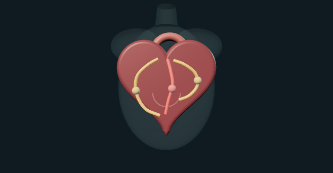

# Cardia Atlas

Cardia Atlas is an educational web prototype for Track A of the Multimodal AI Hackathon 2026. It estimates overall coronary artery disease (CAD) and LAD, LCX, and RCA stenosis probabilities from the UCI Extension of Z-Alizadeh Sani dataset. It combines a FastAPI prediction service, patient-specific SHAP explanations, and an original anatomy-informed 3D heart illustration with schematic coronary paths.

**Developed by Pavitra Gangwar.**

Source repository: <https://github.com/pavitra-G16/cardia-atlas-multimodal-ai-hackathon-2026>. Public app: <https://cardia-atlas.onrender.com> (Render Free; verified on 4 October 2026).

> **Safety:** This is a research and educational prototype, not a diagnostic device or clinical risk calculator. It is not a substitute for a clinician or formal diagnostic imaging. Probabilities are model outputs, not measured stenosis percentages or lesion locations.

## Run the application

Verified runtime: Python 3.14.2, a modern WebGL-enabled browser. No API key, paid service, or external font/model request is needed at runtime. The local environment has no Docker engine, but Render built and started the Docker web service successfully.

```bash
python3 -m venv .venv
.venv/bin/python -m pip install -r requirements.txt
.venv/bin/python -m uvicorn app.main:app --host 127.0.0.1 --port 8000
```

Open <http://127.0.0.1:8000/>. Select **Load demo values** for the synthetic feature-wise median/mode profile, then select **Generate analysis**. The four prediction cards and 3D vessel colours render first; the currently selected outcome's SHAP explanation then loads separately. Edit values and generate again to compare outputs, or select **Clear all** to reset the form and results. Drag the 3D view to rotate, use wheel/pinch to zoom, and select an artery label, vessel card, or result card to inspect its patient-specific explanation. The visible SHAP chart lists the 10 largest absolute contributions among 54 predictors; the additivity check uses the complete contribution set. The demo is not a study patient or evaluation evidence. Inputs are sent to the configured app API for inference and are not stored by the application. Use synthetic data only; do not submit identifiable or real patient data.

## Reproduce the data audit and training

The licensed UCI workbook is already included in `data/raw/`. To retrieve it afresh from the official UCI endpoint and rerun the complete workflow:

```bash
.venv/bin/python scripts/prepare_data.py
.venv/bin/python scripts/build_ui_schema.py
.venv/bin/python scripts/train.py
```

The preparation script verifies expected dimensions, records missingness, duplicates, target distributions, and the CAD/vessel label relationship, then writes a clean CSV and JSON audit. Training uses seed `271828`, 54 predictors, fold-local imputation/encoding/scaling, and nested repeated stratified 5-fold CV (two repeats). In each outer training partition, inner 3-fold ROC-AUC selects one of Logistic Regression, Extra Trees, or Random Forest. The threshold remains 0.50 throughout. A separate 5-fold comparison on all records selects the final pipeline for each target, and each final pipeline is refit on all 303 records. Outer-fold results estimate generalization; final models are not externally validated.

The final serialized artifact is `artifacts/cardia_models.joblib`; per-target pipelines, data audit, feature/UI schema, and metrics are also saved under `artifacts/`. Imputers, encoders, and scalers live inside each serialized pipeline. The source workbook is never modified. The single observed `Fmale` category is normalized to `Female`; invariant `Exertional CP` (all 303 rows equal `N`) is excluded. No record ID exists. The four outcome columns `Cath`, `LAD`, `LCX`, and `RCA` are never predictors. Other observed clinical/ECG/laboratory/echo fields are retained. One row has a CAD/Cath label inconsistent with the OR of the three vessel targets (302/303 agree); the supplied Cath label is preserved for overall CAD.

The UI expands documented clinical shorthand such as DM, HTN, CVA, and CHF using a published description of this dataset's feature names. The UCI variable table does not define numeric code meanings or measurement units; source codes and categories therefore remain unchanged, with unknown code meanings labeled as such. No units are inferred.

## Results (actual experiment)

Reported metrics are outer-fold mean ± SD from two repeats of stratified 5-fold CV. Each outer training partition independently selects among three model families with inner 3-fold ROC-AUC; preprocessing and fitting occur inside the relevant folds. These metrics estimate that nested model-selection procedure, not a particular full-data refit. Separately, the final model family is selected by 5-fold ROC-AUC on all 303 records and refit on all records; that final refit has no independent performance estimate. The threshold is fixed at 0.50. Brier and 5-bin ECE/reliability are descriptive only and do not validate clinical risk probabilities. Targets are imbalanced and results vary by fold. No result establishes clinical utility. Refer to `artifacts/evaluation.json` for fold-level values, confusion matrices, and model selection evidence.

| Target | Accuracy | Precision | Recall | F1 | ROC-AUC |
|---|---:|---:|---:|---:|---:|
| CAD | 0.86 ± 0.05 | 0.92 ± 0.04 | 0.88 ± 0.06 | 0.90 ± 0.04 | 0.92 ± 0.03 |
| LAD | 0.77 ± 0.06 | 0.80 ± 0.07 | 0.83 ± 0.06 | 0.81 ± 0.04 | 0.84 ± 0.05 |
| LCX | 0.70 ± 0.07 | 0.63 ± 0.11 | 0.63 ± 0.10 | 0.63 ± 0.08 | 0.75 ± 0.08 |
| RCA | 0.65 ± 0.05 | 0.54 ± 0.06 | 0.55 ± 0.11 | 0.54 ± 0.07 | 0.72 ± 0.06 |

Values are outer-fold mean ± standard deviation across two repeats of stratified 5-fold validation. The cohort has 303 records, targets are imbalanced, and vessel metrics vary across folds. There is no external cohort, independent holdout, clinical threshold validation, or evidence of clinical utility.



*Original schematic diagram of the code-generated 3D illustration. Broad coronary courses follow cited anatomy references; this is not a patient-derived or clinician-reviewed anatomical mesh, and it does not show segment-level disease or measured lesions.*

## Architecture

- `app/main.py`: FastAPI API, input validation, inference, feature mapping, SHAP, health/schema/performance endpoints.
- `app/static/`: responsive browser UI and bundled Three.js modules; the heart and simplified vessel geometry are original procedural code, not a downloaded medical mesh.
- `scripts/prepare_data.py`: reproducible official-source data acquisition and audit.
- `scripts/train.py`: nested model comparison and final refit.
- `scripts/build_ui_schema.py`: constructs the form schema from observed feature values.
- `artifacts/`: serialized model pipelines, schema, audit and real experiment outputs.
- `reports/`: editable report source, generated PDF and actual validation figure.
- `docs/`: requirement checklist and third-party attribution.

The visualization is an anterior-view educational illustration. LAD follows the anterior interventricular groove toward the apex; LCX tracks the left atrioventricular groove toward patient-left/viewer-right; RCA tracks the right atrioventricular groove toward patient-right/viewer-left. Rotate with drag, zoom with wheel/pinch, and select via artery label/card. Continuous color bins are illustrative only: [0,33%) green, [33,67%) amber, [67,100%] red. Selecting a vessel updates its SHAP summary. No output paints a measured lesion location. Anatomy guidance and original-geometry provenance are listed in `docs/third_party_notices.md`.

## API

- `GET /api/health`
- `GET /api/schema`
- `GET /api/performance`
- `GET /api/example`
- `POST /api/predict` with `{"values": {"Age": 58, ...}}`. The default response includes four explanations for API compatibility; send `"include_explanations": false` for immediate four-target scores.
- `POST /api/explain/{CAD|LAD|LCX|RCA}` with `{"values": {"Age": 58, ...}}` for one on-demand explanation of the selected target.

Fields may be omitted or blank and are imputed. Unknown fields, invalid categories, non-finite values, and numeric values outside the observed source range are rejected with HTTP 422; the prototype blocks extrapolation beyond the small dataset's observed range. Scores are returned for CAD/LAD/LCX/RCA. SHAP uses a fixed 24-row background, six permutation cycles, and the deployed preprocessing/model. One-hot contributions are summed back to source input fields. Output and contributions are in positive-class probability units; the expected baseline plus all contributions equals the model score (verified). Permutation SHAP is approximate with finite permutations; contributions are associations, not causes.

## Checks

Run the focused artifact/schema/serialization checks:

```bash
.venv/bin/python -m unittest discover -s tests -v
```

The integrated local API was exercised with the synthetic demo profile, all fields missing, and an invalid category; model probability, 422 validation and SHAP additivity were inspected. WebGL rendering, input flow, visible outputs, and vessel selection were inspected in the local browser. See the report and `docs/verification.md` for checks that remain unavailable in this environment.

## Build and container

`Dockerfile` packages the API, bundled UI, model pipelines, and data required for example inputs and SHAP. It listens on `PORT` (default 10000), exposes `/api/health` as its health check, and `render.yaml` is a Render Blueprint with automatic Git deployment enabled. The browser requests four scores first and loads only the selected SHAP explanation afterwards, so model-output cards are not delayed by the other three explanation calculations. Render Free still sleeps when idle and has host resource limits; a cold start cannot be eliminated by the Blueprint itself.

```bash
docker build -t cardia-atlas .
docker run --rm -e PORT=8000 -p 8000:8000 cardia-atlas
```

The public application is [https://cardia-atlas.onrender.com](https://cardia-atlas.onrender.com). The public source is [GitHub](https://github.com/pavitra-G16/cardia-atlas-multimodal-ai-hackathon-2026). The deployed app was checked for health, schema, performance, median/mode synthetic input, valid four-target inference, all four explanations, additivity, edited input updates, vessel selection, reset, and repeat prediction. The free instance sleeps when idle; its first request can have a cold start. Two observed hosted prediction requests took 55.25 and 59.28 seconds; this small sample does not estimate typical latency.

## Hackathon submission notes

Track A requires a 3–10 minute YouTube demonstration. The supplied [timed script](demo_script.md) targets five minutes; recording, upload, and Devpost submission remain entrant actions. The [official event overview](https://multimodal-ai-hackathon-2026-7.devpost.com/) shows an age-14+ and student-only requirement, while the [Rules page](https://multimodal-ai-hackathon-2026-7.devpost.com/rules) says individuals aged 14+ may apply and describes the event as primarily intended for college students. Confirm eligibility with the organizer if your status is unclear. The current Devpost submission editor requires sign-in and its field/file limits could not be inspected here; no additional limit is assumed. The listed deadline is 15 October 2026, 12:15 AM IST.

## Data and third-party attribution

- Dataset: Alizadehsani, R., Roshanzamir, M., & Sani, Z. (2013). *extention of Z-Alizadeh sani dataset*. UCI Machine Learning Repository, DOI [10.24432/C5461K](https://doi.org/10.24432/C5461K), CC BY 4.0. Source entry: <https://archive.ics.uci.edu/dataset/411/extention%2Bof%2Bz%2B>.
- Three.js 0.180.0, MIT License; runtime modules are bundled under `app/static/vendor/`, with copyright/license headers preserved. Source: <https://github.com/mrdoob/three.js>.
- No external anatomical mesh or image is used. The procedural heart/artery drawing is original schematic code and is not anatomically precise.
- AI disclosure: OpenAI Codex was used to assist with code, model workflow, interface, testing and documentation. The entrant must understand and be able to explain the submitted work. Disclose OpenAI Codex in the Devpost “Built With” field as well as here.
